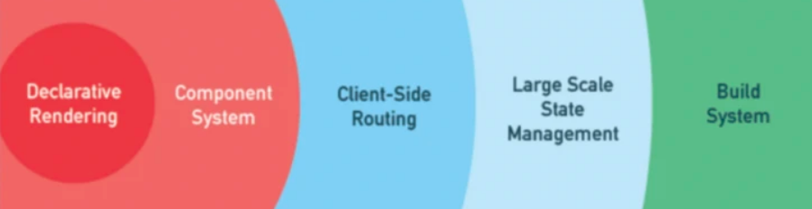

# vue 概述

- `vue` 是一套用于构建用户界面的 `Js` 框架。
  - [渐进式](#01-渐进式)
  - [数据驱动](#02-数据驱动)
- 组件机制。
- 虚拟 DOM。
- 路由机制。


## 01 渐进式


通常用 `Vue` 构建的项目包括下面这些内容：

- 声明式渲染
- 组件系统
- 客户端路由
- 状态管理
- 构建工具

但是在使用 `Vue` 时可以只使用其中的一部分功能，把 `Vue`当作一个 `Js` 工具库来使用。当然随着项目功能的增加，还可以在引入「组件系统」、「路由机制」等。

例如，在网页中导入 `vue.js`，使用其中的 `v-model` 指令，来获取 `<input>` 的内容。

```html
<html>
  <body>
    <div>
      <p>{{ msg }}</p>
      <input type="text" v-mode="msg">
    </div>
  </body>
  <script src="https://unpkg.com/vue@3"></script>
  <script>
    const { createApp, ref } = Vue;
    createApp({
      setup() {
        let msg = ref();
        return {
          msg
        }
      }
    }).mount('#app');
  </script>
</html>
```


## 02 数据驱动


`Vue` 基于 `MVVM` 模式，它的核心库只关注「视图层」，开发着不用再去关注 `DOM` 的操作，可以专注于业务逻辑的开发。 

当数据改变时，由「响应式机制」来自动更新 `DOM`，完成页面的刷新。


## 参考
- https://segmentfault.com/a/1190000021290972